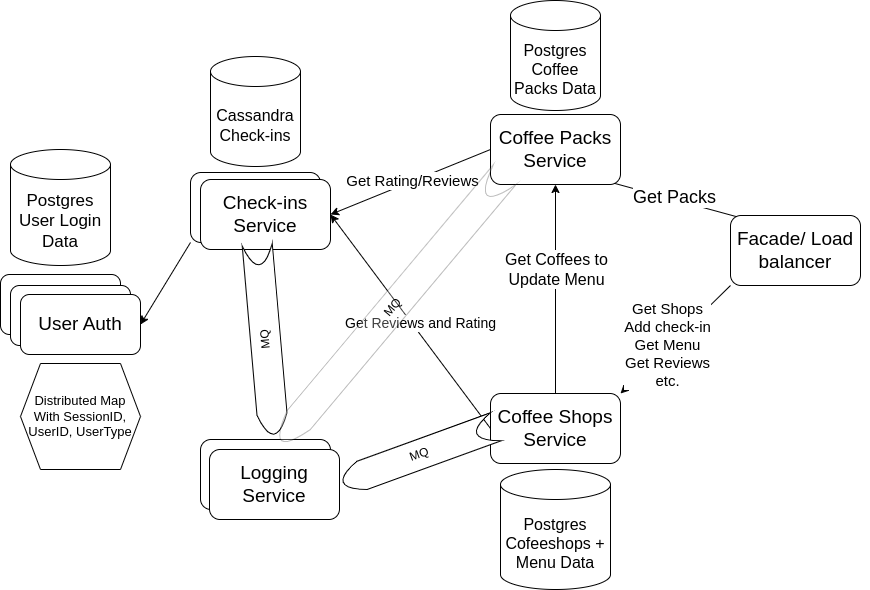

# kavuny

Software Architecture Course Project

Authors: [Ivan Shevchenko](https://github.com/ishevche) and [Roman Mutel](https://github.com/rwmutel)

## Vision

We were inspired by a US startup called Untappd, which was founded back in 2010. It is de-factor a beer-centered social network, letting users "check in" when they are at the pub, leave reviews for particular drinks and places, earn badges, see venues' menus and many other. The app had its first **million users in 2014** and reached 3.2 million users mark in 2016.

And we decided, why not making something similar for coffee beans and coffee places? Back in the days of intoxicated water, the shift from beer to coffee, according to some researchers, drove the industrial revolution (since it is obviously easier to invent new things when sober). Ukraine is famous for numerous award-winning roasteries and baristas, meanwhile the level of coffee culture and the interest in quality coffee continue growing.

Main use case of our app is to be some kind of a social network to discover and rate everything related to coffee, primarily the beans and the cafes/coffee shops. Formally:

1. users can search for coffee packs and coffee places
2. users can leave their feedback on both beans and places
3. shops and cafe stuff can track new releases from the roasteries
4. shops can host their menus for the clients directly using the app

## Structure

The microservices documentation is located in [SERVICES.md](SERVICES.md) file. The overall interaction between the servers is as illustrated on the diagram below:



## Deployment

The whole API is deployed as a docker compose project using a single command:

```shell
docker compose up --build -d
```

To stop the app, one should use usual compose down command:

```shell
docker compose down
```
